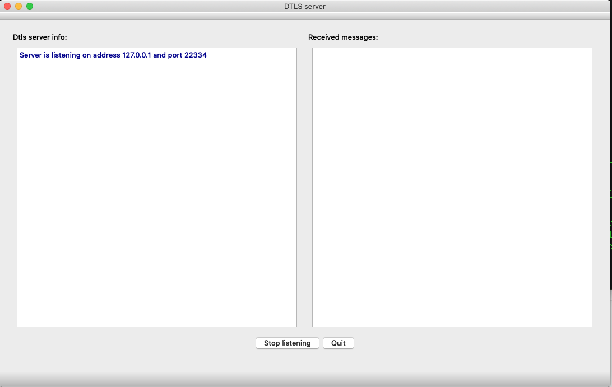

# Qt5 官方的 DTLS Server 样例程序

__英文文档:__
 - DTLS Server demo 样例程序: https://doc.qt.io/qt-5/qtnetwork-secureudpserver-example.html
 - QDtls API 接口文档 https://doc.qt.io/qt-5/qdtls.html

## 样例程序截图

## Qt 5.12 Examples 源文件列表
[Examples/Qt-5.12.2/network/secureudpserver/](./secureudpserver/) 目录文件如下:
- Examples/Qt-5.12.2/network/secureudpserver/main.cpp
- Examples/Qt-5.12.2/network/secureudpserver/mainwindow.cpp
- Examples/Qt-5.12.2/network/secureudpserver/mainwindow.h
- Examples/Qt-5.12.2/network/secureudpserver/mainwindow.ui
- Examples/Qt-5.12.2/network/secureudpserver/nicselector.cpp
- Examples/Qt-5.12.2/network/secureudpserver/nicselector.h
- Examples/Qt-5.12.2/network/secureudpserver/nicselector.ui
- Examples/Qt-5.12.2/network/secureudpserver/secureudpserver.pro
- Examples/Qt-5.12.2/network/secureudpserver/server.cpp
- Examples/Qt-5.12.2/network/secureudpserver/server.h

## API 兼容性
 - 要求 Qt 版本大于等于 5.12
